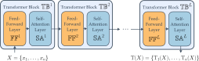

<!-- Title -->
<h1 align="center">
  Exact Sequence Interpolation with Transformers
</h1>

<p align="center">
  <a href="https://arxiv.org/abs/2502.02270">
    
  </a>
</p>

`Python` code for the paper 
**Exact Sequence Interpolation with Transformers** by Albert Alcalde, Giovanni Fantuzzi, and Enrique Zuazua. 

<p align="center">
  
</p>

## Abstract
We prove that transformers can exactly interpolate datasets of finite input sequences in $\mathbb{R}^d$, $d\geq 2$, with corresponding output sequences of smaller or equal length. Specifically, given $N$ sequences of arbitrary but finite lengths in $\mathbb{R}^d$ and output sequences of lengths $m^1, \dots, m^N \in \mathbb{N}$, we construct a transformer with $\mathcal{O}(\sum_{j=1}^N m^j)$ blocks and $\mathcal{O}(d \sum_{j=1}^N m^j)$ parameters that exactly interpolates the dataset.
Our construction provides complexity estimates that are independent of the input sequence length, by alternating feed-forward and self-attention layers and by capitalizing on the clustering effect inherent to the latter. Our novel constructive method also uses low-rank parameter matrices in the self-attention mechanism, a common feature of practical transformer implementations. 
These results are first established in the hardmax self-attention setting, where the geometric structure permits an explicit and quantitative analysis, and are then extended to the softmax setting. Finally, we demonstrate the applicability of our exact interpolation construction to learning problems, in particular by providing convergence guarantees to a global minimizer under regularized training strategies. Our analysis contributes to the theoretical understanding of transformer models, offering an explanation for their excellent performance in exact sequence-to-sequence interpolation tasks.

## Citation

```bibtex

@misc{alcalde2025exact,
      title={Exact Sequence Interpolation with Transformers}, 
      author={Albert Alcalde and Giovanni Fantuzzi and Enrique Zuazua},
      year={2025},
      eprint={2502.02270},
      archivePrefix={arXiv},
      primaryClass={cs.LG},
      url={https://arxiv.org/abs/2502.02270}
}
```